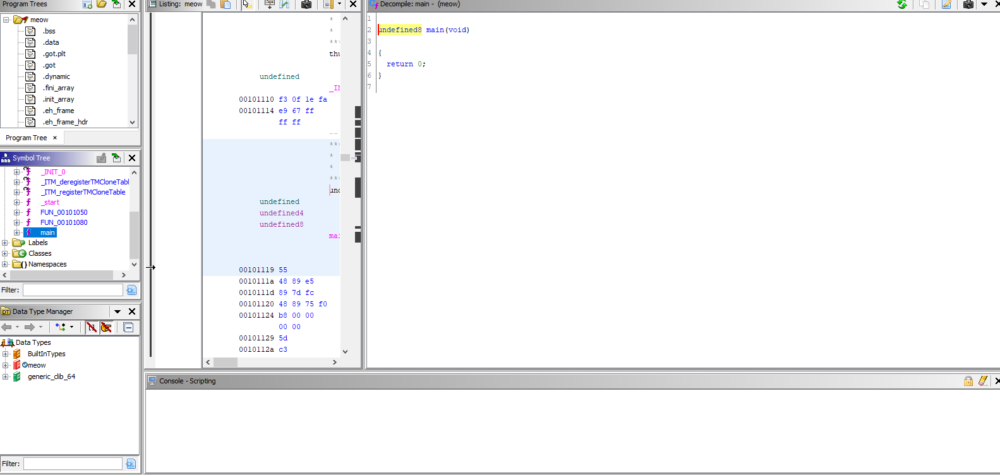
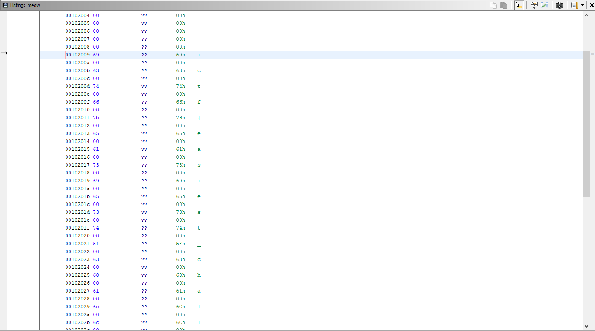
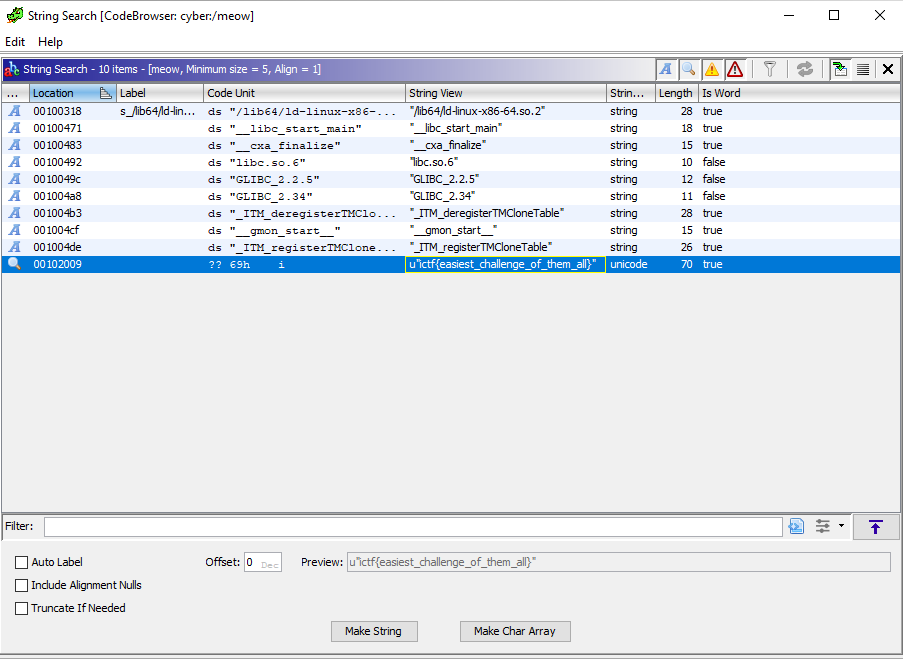

# Meow
## Difficulty: Easy

The challenge is an empty program (literally), as nothing happens when the ELF binary is executed.

Always go for the quick wins (as per CTF lore), so we use ```strings``` and ```strace```.

No interesting strings are returned, and ```strace``` reveals that the program exited as soon as it was executed.

Time for Ghidra :)

When tossed into a disassembler, we can see that the main function is quite literally empty.



This tells us that we need to look throughout the different segments of the ELF binary, as well as for any strings.

### Hidden in Plain Sight

Upon further inspection of strings witin the program and the various section headers, we can see there is a string located in the .rodata segment.




We can also obtain the flag by searching for strings within the program that don't contain any terminators.



Flag:

**ictf{easiest_challenge_of_them_all}**